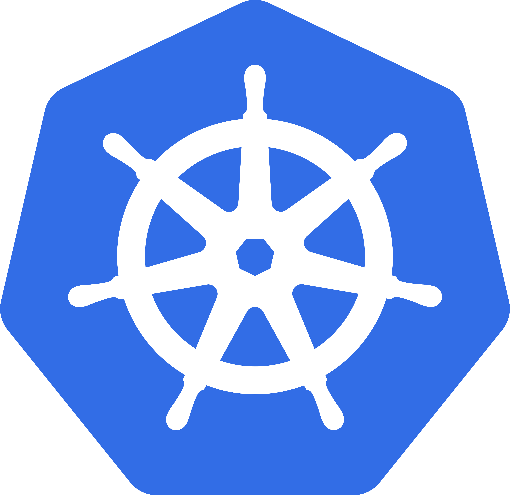

 

# The NuoDB Operator

A Kubernetes Operator that automates the installation, provisioning, and management of deploying the NuoDB database in Kubernetes. The NuoDB Kubernetes Operator will deploy the NuoDB Community Edition (CE) database on Kubernetes distributions running **v1.14 or v1.15** on the following cloud provider platforms:

<p align="center"> Run NuoDB where you want, when you want, and how you want ... </p>

  &nbsp;&nbsp;&nbsp;    &nbsp;&nbsp;&nbsp;   &nbsp;&nbsp;&nbsp;    &nbsp;&nbsp;&nbsp;     &nbsp;&nbsp;&nbsp;  

**NOTE:** The NuoDB Operator is ideal for development, test and for product evaluation purposes in single cluster Kubernetes environments. **The NuoDB Operator is not available for production use.** To use NuoDB in Kubernetes production deployments, please refer to the [NuoDB Helm Charts](https://github.com/nuodb/nuodb-helm-charts) github repository . The NuoDB Helm Charts are production ready and fully support day-2 operational tasks such as backup and recovery, rolling upgrade, and can also be deployed in Multi-cluster / Multi-cloud environments. 

The NuoDB Operator also supports deploying NuoDB with either ephemeral or persistent storage options with configurations to run NuoDB Insights, a visual database monitoring Web UI, and start a sample application (ycsb) to quickly generate a user-configurable SQL workload against the database.

## NuoDB Operator Version support
For a list of supported NuoDB Operator releases and where to download, click the `Releases` tab above. To enable automated notification of new releases, click the Watch button above and subscribe to the Releases Only selection. 

## About the NuoDB Community Edition Capability
The NuoDB Community Edition (CE) capability is full-featured, but limits the database to one Storage Manager (SM) and three Transaction Engine (TE) processes. The Community Edition is free of charge and allows you to self-evaluate NuoDB at your own pace. The NuoDB Community Edition (CE) will allow first time users to experience all the benefits and value points of NuoDB including: 

* Ease of scale-out to meet changing application throughput requirements
* Continuous availability even in the event of common network, hardware, and software failures
* NuoDB database and workload visual monitoring with NuoDB Insights
* ANSI SQL
* ACID transactions

To effectively evaluate the NuoDB Community Edition (CE) we recommend creating a Kubernetes cluster of at least three nodes. To fully demonstrate transactional scale-out and database continuous availability we recommend four or five nodes.

As you proceed through the steps outlined on this page, we would like your self-guided NuoDB CE operator and database experience in Kubernetes to be a positive one! Please reach out to us at support@nuodb.com with any questions or comments you may have. We would be glad to learn more about your specific use case and provide assistance if needed!

To trial or run a PoC of the NuoDB Enterprise Edition (EE) which also allows users to scale the Storage Manager (SM) database process, contact NuoDB Sales at sales@nuodb.com for a PoC time-based enterprise edition license. For more information about NuoDB, see the [NuoDB Website](https://www.nuodb.com).

## NuoDB Operator Page Outline
This page is organized in the following sections:

&nbsp;&nbsp;&nbsp;&nbsp;&nbsp;&nbsp;[Installation Prerequisites](#Installation-Prerequisites)

&nbsp;&nbsp;&nbsp;&nbsp;&nbsp;&nbsp;[About NuoDB Insights Visual Monitor](#About-NuoDB-Insights-Visual-Monitor)

&nbsp;&nbsp;&nbsp;&nbsp;&nbsp;&nbsp;[Install the NuoDB Operator](#Install-the-NuoDB-Operator)

&nbsp;&nbsp;&nbsp;&nbsp;&nbsp;&nbsp;[Deploy the NuoDB Database](#Deploy-the-NuoDB-Database)

&nbsp;&nbsp;&nbsp;&nbsp;&nbsp;&nbsp;[Connect to your Database using nuosql](#Connect-to-your-Database-using-nuosql)

&nbsp;&nbsp;&nbsp;&nbsp;&nbsp;&nbsp;[Launch a Sample SQL Workload](#Launch-a-Sample-SQL-Workload)

&nbsp;&nbsp;&nbsp;&nbsp;&nbsp;&nbsp;[NuoDB Features and Benefits Evaluation Steps](#NuoDB-Features-and-Benefits-Evaluation-Steps)

&nbsp;&nbsp;&nbsp;&nbsp;&nbsp;&nbsp;[Delete the NuoDB Database and Operator](#Delete-the-NuoDB-Database-and-Operator)

&nbsp;&nbsp;&nbsp;&nbsp;&nbsp;&nbsp;[Configuration Parameters](#Configuration-Parameters)


## Installation Prerequisites

Please review and perform the following steps to prepare your Kubernetes environment for your NuoDB Operator and Database installation.

[Installation Prerequisites Steps](documentation/installation-prerequisites)

## About NuoDB Insights Visual Monitor


Optionally deploy the NuoDB Insights visual monitoring tool **(recommended)**. NuoDB Insights is a powerful database monitoring tool that can greatly aid in visualizing database workload and resource consumption. For more information about the benefits of using NuoDB Insights please refer to the [NuoDB Insights](https://www.nuodb.com/product/insights) Webpage.

When using NuoDB Insights all performance information collected is privately stored and managed locally on your Kubernetes cluster. NuoDB Insights uses the ELK stack of tools (Elasticsearch, Logstash, and Kibana). Grafana is also utilized by the NuoDB Insights to visually present the performance data. 

## Install the NuoDB Operator

Follow the specfic instructions provided below for your **Kubernetes Distribution**.
Please **complete** the NuoDB Operator [installation prerequisites steps](documentation/installation-prerequisites)
 before proceeding.

### Install the NuoDB Operator on Google Cloud GKE Kubernetes
 Using the GCP Marketplace, visit the [NuoDB Operator](https://console.cloud.google.com/marketplace/details/nuodb/nuodb-database-operator?q=nuodb) published Operator page. Click the `Configure` button and follow the on-screen instructions to deploy the NuoDB Operator. The steps are outlined here:
1. Select a GCP Project. 
2. Either create a GKE cluster or choose an existing one from the list
3. Create a namespace called `nuodb` in which to install the NuoDB Operator
4. Take defaults for `App instance name` and `Cluster Admin Service Account` and click the `Deploy` button.
Your NuoDB Operator will deploy in several minutes. Use the GCP Kubernetes Engine Web UI "Workloads" selection to monitor progress.

### Install the NuoDB Operator on Red Hat OpenShift v4.x
 In OpenShift 4.x, the NuoDB Operator is available to install directly from the OpenShift OperatorHub, an integrated service catalog, accessible from within the OpenShift 4 Web UI which creates a seamless - single click experience - that allows users to install the NuoDB Operator from catalog-to-cluster in seconds. The steps are outlined here:
1. Select `OperatorHub` under the `Catalog` section in the OCP 4 left toolbar and navigate to the NuoDB Application tile.
2. Click the tile and on the NuoDB Operator page, click the `Install` button.
3. On the "Create Operator Subscription" page, select the option "A specific namespace on the cluster"
   and enter the project/namespace to install the NuoDB Operator.
4. Select `Subscribe` to subscribe and install the NuoDB Operator.

The following video provides a full walk-thru of how to deploy the NuoDB Operator and database in OpenShift 4.x. 

&nbsp;&nbsp;&nbsp;&nbsp;&nbsp;&nbsp;[NuoDB in OpenShift v4.x video](https://youtu.be/KYx_B_ykbtU)

&nbsp;&nbsp;&nbsp;&nbsp;&nbsp;&nbsp;**NOTE:** The same benefit areas demonstrated in this video can also be demonstrated in any NuoDB supported Kubernetes managed environment.

### Install the NuoDB Operator on Amazon EKS, Azure AKS, Google Anthos GKE, Open Source Kubernetes, or Docker Desktop Kubernetes

  &nbsp;&nbsp;&nbsp;&nbsp;&nbsp;&nbsp;&nbsp;&nbsp;&nbsp;&nbsp;&nbsp;&nbsp;    &nbsp;&nbsp;&nbsp;&nbsp;&nbsp;&nbsp;&nbsp;&nbsp;&nbsp;&nbsp;&nbsp;&nbsp;    &nbsp;&nbsp;&nbsp;&nbsp;&nbsp;&nbsp;&nbsp;&nbsp;&nbsp;&nbsp;    &nbsp;&nbsp;&nbsp;&nbsp;&nbsp;&nbsp;&nbsp;&nbsp;&nbsp;&nbsp;  

First, install the Operator Lifecycle Manager (OLM) v12.0. We have also successfully tested with v11.0 and v13.0 if you prefer.
```
kubectl apply -f https://github.com/operator-framework/operator-lifecycle-manager/releases/download/0.12.0/crds.yaml
kubectl apply -f https://github.com/operator-framework/operator-lifecycle-manager/releases/download/0.12.0/olm.yaml
```

#### NuoDB Operator Linux CLI Install Script
Below is a sample NuoDB Operator install script. Run the commands line by line or enter them into a script file and execute to deploy the NuoDB Operator.
```
# Set the environment context to the namespace you will deploy the NuoDB Operator
kubectl config set-context --current --namespace=$OPERATOR_NAMESPACE

kubectl create -n $OPERATOR_NAMESPACE -f nuodb-operator/deploy/operatorGroup.yaml
kubectl create -n $OPERATOR_NAMESPACE -f nuodb-operator/deploy/cluster_role.yaml
kubectl create -f nuodb-operator/deploy/cluster_role_binding.yaml
kubectl create -n $OPERATOR_NAMESPACE -f nuodb-operator/deploy/role.yaml
kubectl create -n $OPERATOR_NAMESPACE -f nuodb-operator/deploy/role_binding.yaml
kubectl create -n $OPERATOR_NAMESPACE -f nuodb-operator/deploy/service_account.yaml

## add NuoDB, Insights, and ycsb sample SQL app CRDs
kubectl create -f nuodb-operator/deploy/crds/nuodb_v2alpha1_nuodb_crd.yaml
kubectl create -f nuodb-operator/deploy/crds/nuodb_v2alpha1_nuodbinsightsserver_crd.yaml
kubectl create -f nuodb-operator/deploy/crds/nuodb_v2alpha1_nuodbycsbwl_crd.yaml

# create a local copy of the nuodb-csv.yaml file and update the file with your $OPERATOR_NAMESPACE value.
sed "s/placeholder/$OPERATOR_NAMESPACE/" nuodb-operator/deploy/olm-catalog/nuodb-operator/$NUODB_OPERATOR_VERSION/nuodb-operator.v$NUODB_OPERATOR_VERSION.clusterserviceversion.yaml > nuodb-csv.yaml

# Optionally, you may pull the NuoDB Operator image from quay.io (the default)
# or other available locations by following these examples:
   # 1. Red Hat Ecosystem Catalog, run
   #    sed "s/quay.io/registry.connect.redhat.com/" nuodb-csv.yaml > nuodb-csv-rhcc.yaml
   # 2. Google Cloud Platform Marketplace, run
   #    sed "s/quay.io/marketplace.gcr.io/" nuodb-csv.yaml > nuodb-csv-gcp.yaml
   # 3. AWS Marketplace, run
   #    cp nuodb-csv.yaml nuodb-csv-aws.yaml
   #    Edit the file and replace the two image references with the following value:
   #    117940112483.dkr.ecr.us-east-1.amazonaws.com/d893f8e5-fe12-4e43-b792-8cb98ffc11c0/cg-1228790192/quay.io/nuodb/nuodb-operator:2.0.3-2-latest
   # Lastly, copy your modified nuodb-csv-xxx.yaml file to nuodb-csv.yaml
   #    cp nuodb-csv-xxx.yaml nuodb-csv.yaml

kubectl create -n $OPERATOR_NAMESPACE -f nuodb-csv.yaml

# Check deployment rollout status every 5 seconds (max 10 minutes) until complete.
ATTEMPTS=0
ROLLOUT_STATUS_CMD="kubectl rollout status deployment/nuodb-operator -n $OPERATOR_NAMESPACE"
until $ROLLOUT_STATUS_CMD || [ $ATTEMPTS -eq 60 ]; do
  ATTEMPTS=$((attempts + 1))
  sleep 5
done
```

#### Install the Kubernetes Web UI Dashboard

Red Hat OpenShift, Google GKE and GKE/Anthos offer a built-in Web UI Kubernetes Dashboard and Workload Manager. For other Kubernetes distributions we recommend installing the open source Kubernetes Web UI Dashboard to easily manage and monitor your Kubernetes deployments. To install, follow the instructions provided in the Kubernetes [documentation](https://kubernetes.io/docs/tasks/access-application-cluster/web-ui-dashboard).

## Deploy the NuoDB Database

Please review and complete the NuoDB Database [installation prerequisites](documentation/installation-prerequisites#nuodb-database-prerequisites) before proceeding. 

### Sample Database deployment files

The nuodb-operator/deploy/crds directory includes sample Custom Resources yaml files that can be used to deploy a NuoDB database, NuoDB Insights, and the ycsb sample workload generator. 

```
nuodb_v2alpha1_nuodb_cr.yaml
nuodb_v2alpha1_nuodbinsightsserver_cr.yaml
nuodb_v2alpha1_nuodbycsbwl_cr.yaml`
```

Optionally, you can add or modify any of the below parameters values to your own customer resource files to customize your deployment. Each parameter is described in the optional [Database Parameters](documentation/configuration-parameters) section. Sample deployment files are provided below. 

#### nuodb_v2alpha1_nuodb_cr.yaml

This modified sample file below starts three NuoDB admin processes, a database named *test*, uses persistent storage, uses AWS general purpose EBS storage (gp2), and includes various other configurations like controlling the number of desired TE pods, CPU, and memory used per NuoDB process type.
```
spec:
  storageMode: persistent
  adminCount: 3
  adminStorageSize: 5Gi
  adminStorageClass: gp2
  apiServer: https://domain:8888
  container: nuodb/nuodb-ce:latest
  storageMode: persistent
  dbName: db
  dbUser: dba
  dbPassword: <changeMe>
  smCount: 1
  smMemory: 4Gi
  smCpu: "2"
  smStorageSize: 20G
  smStorageClass: gp2
  engineOptions: ""
  teCount: 1
  teMemory: 4Gi
  teCpu: "2"
  container: nuodb/nuodb-ce:latest
```

We recommend replacing the database password `dbPassword` value with one of your choice.

_**NOTE:** If your Kubernetes cluster has less than three worker nodes (four are recommended) then modify your `adminCount` value to equal the number of worker nodes in your cluster. This will deploy one NuoDB Admin process per worker node._ 

_**NOTE:** To run on **MacOS Docker Desktop Kubernetes** -- which is useful for testing basic functionality and not performance -- size down the default NuoDB (TE) and (SM) CPU and MEMORY usage to fit the deployment on a single host. In this configuration, the NuoDB Insights monitoring tool will take about 5 minutes to start. For NuoDB CPU and MEMORY adjustments, see the additional sample nuodb_v2alpha1_nuodb_cr.yaml recommendations below for admin count, CPU, MEMORY, and required StorageClass setting._

```
  adminCount: 1
  adminStorageClass: hostpath
  smMemory: 300Mi
  smCpu: 300m
  smStorageClass: hostpath
  teMemory: 300Mi
  teCpu: 300m
```

#### nuodb_v2alpha1_nuodbinsightsserver_cr.yaml

This modified sample file below starts NuoDB Insights and uses AWS general purpose EBS storage (gp2) to persist monitoring data.
```
spec:
  elasticVersion: 7.3.0
  elasticNodeCount: 1
  kibanaVersion: 7.3.0
  kibanaNodeCount: 1
  storageClass: gp2
```
**NOTE:**  For parameters `adminStorageClass`, `smStorageClass`, and `storageClass` enter the Kubernetes storage class value you wish to use. For example, 

| Public Cloud  | Kubernetes Storage Class  |
|---------------|---------------------------|
| AWS           | gp2                       |
| GCP           | standard                  |
| AZURE         | managed-premium           |

**NOTE:**  For Docker Desktop Kubernetes use the Docker Desktop Kubernetes provided storage class `hostpath`.

  
| User Config'd       | Kubernetes Storage Class  |
|---------------------|---------------------------|
| Local Node Storage  | local-disk                |
| 3rd-Party (CSI)     | vendor specific value     |

#### nuodb_v2alpha1_nuodbycsbwl_cr.yaml

This modified sample file below will create a SQL workload `ReplicationController` named `ycsb-load` on database `db`, but doesn't start any pods initially (note: `ycsbWorkloadCount` of 0). This allows you to start up your database and Insights monitoring first, then start your SQL workload manually when you like. See section below, [Launch a Sample SQL Workload](#Launch-a-Sample-SQL-Workload) on how to start your ycsb SQL workload generator. For a description of the other ycsb parameters and how to use them, see [Configuration Parameters](#Configuration-Parameters).
```
spec:
  dbName: db
  ycsbWorkloadCount: 0
  ycsbLoadName: ycsb-load
  ycsbWorkload: b
  ycsbLbPolicy: ""
  ycsbNoOfProcesses: 5
  ycsbNoOfRows: 10000
  ycsbNoOfIterations: 0
  ycsbOpsPerIteration: 10000
  ycsbMaxDelay: 240000
  ycsbDbSchema: User1
  ycsbContainer: nuodb/ycsb:latest
```

### Sample NuoDB database deployment script

This sample deploys a NuoDB database with the NuoDB Insight visual monitoring tool and starts a sample SQL application
```
# Set the environment context to the namespace you will deploy the NuoDB Operator
kubectl config set-context --current --namespace=$OPERATOR_NAMESPACE

# add cluster-admin permissions to the nuodb-operator service account                               
kubectl create -f nuodb-operator/deploy/cluster-op-admin.yaml

# Modify / customize your NuoDB cr yaml files and run, 
kubectl create -n $OPERATOR_NAMESPACE -f nuodb-operator/deploy/crds/nuodb_v2alpha1_nuodb_cr.yaml
kubectl create -n $OPERATOR_NAMESPACE -f nuodb-operator/deploy/crds/nuodb_v2alpha1_nuodbinsightsserver_cr.yaml
kubectl create -n $OPERATOR_NAMESPACE -f nuodb-operator/deploy/crds/nuodb_v2alpha1_nuodb-ycsbwl_cr.yaml

# Wait for Nuodb Insights logstash instance to start
ATTEMPTS=0
echo ""
echo -n "NuoDB Insights rollout started "
ROLLOUT_STATUS_CMD="kubectl rollout status sts/insights-server-release-logstash -n $OPERATOR_NAMESPACE"
until $ROLLOUT_STATUS_CMD &> /dev/null || [ $ATTEMPTS -eq 60 ]; do
  ATTEMPTS=$((attempts + 1))
  echo -n "."
  sleep 10
done
echo "Done."

# create the Insights client
kubectl create -f nuodb-operator/build/etc/insights-server/insights-client.yaml
 
echo "Obtain your NuoDB Insights Dashboard URL:"
echo "For Red Hat OpenShift, go to URL:"
echo "   https://$(kubectl get route grafana-route --output=jsonpath={.spec.host})/d/000000002/system-overview?orgId=1&refresh=10s"
echo ""
echo "For Google GKE, go to URL:"
echo "   http://$(kubectl get ingress grafana-ingress --output=jsonpath={.status.loadBalancer.ingress[0].ip})/d/000000002/system-overview?orgId=1&refresh=10s"
echo ""
echo "For AKS, EKS or open source K8S,"
echo "Run the following command in a terminal window suitable for logging output commands:"
echo "   $ kubectl port-forward service/grafana-service 3000 &"
echo "Go to URL:"
echo "   localhost:3000/d/000000002/system-overview?orgId=1&refresh=10s"   
 ```

The above sample database deployment shell script will display to your screen your NuoDB Insights dashboard URL. 
**NOTE:** It may take several minutes for the NuoDB Insights URL to become available. 

## Connect to your Database using nuosql

Once your database is running, you can connect and run SQL using the NuoDB nuosql command tool. See sample below:

```
kubectl exec -it admin-0 bash
nuosql <db-name> --user dba --password secret
SQL>
```
For more information on how to run SQL, see [Using NuoDB SQL Command Line](http://doc.nuodb.com/Latest/Default.htm#Using-NuoDB-SQL-Command-Line.htm) and [NuoDB SQL Development](http://doc.nuodb.com/Latest/Default.htm#SQL-Development.htm) online documentation.

## Launch a Sample SQL Workload

The NuoDB Operator includes a sample SQL application that will allow you to get started quickly running SQL statements against your NuoDB database. The sample workload uses YCSB (the Yahoo Cloud Serving Benchmark). The YCSB custom resource yaml file includes YCSB parameters that will allow you to configure the SQL workload to your preferences.

To start a SQL Workload (if your `nuodb-ycsbwl-cr.yaml` wasn't configured to start one by default) locate the ycsb Replication Controller in your Kubernetes dashboard and scale it to your desired number of pods to create your desired SQL application workload. Once the YCSB application is running the resulting SQL workload will be viewable from the NuoDB Insights visual monitoring WebUI.

Optionally, to scale out or in your YCSB sample application to generate more or less SQL statements/sec, from the command line, run
```
kubectl edit nuodbycsbwl
```
Edit the parameter value for `ycsbWorkloadCount`to your desired number of pods and save the file. Kubernetes will immediately start to scale the YCSB pods to your desired amount.

## NuoDB Features and Benefits Evaluation Steps

Once your NuoDB database and Insights visual monitor are running, here are a few steps to try out to quickly realize the benefits of running a NuoDB SQL database

* **Demonstrate Transactional Scale-out**

To easily scale out your NuoDB Transaction Engines (TEs) to meet an increased SQL application workload, from the command line, run,
```    
kubectl edit nuodb
```    
Edit the parameter value for `teCount` to your desired number of pods and save the file. Kubernetes will immediately start to scale the NuoDB Transaction Engine (TE) pods to your desired amount.

Using **NuoDB Insights**, monitor the SQL application during the time of increased application workload and the scale-out of TEs and observe the increase in transactional throughput, Transactions Per Second (TPS) 
    
* **Demonstrate Continuous Availability**

Deploy your NuoDB system with three NuoDB Admins and three Transaction Engines (TEs). Using either your Kubernetes dashboard or the `kubectl delete pod` CLI command, forcibly delete either a NuoDB Admin or a TE pod. **Note:** when using the Community Edition, only 1 Storage Manager (SM) is available. 
    
Using **NuoDB Insights**, monitor the SQL application during the time of the forced pod deletes and observe that SQL application availability continues unimpeded while the Kubernetes system and NuoDB recover from failure events in seconds.

## Delete the NuoDB Database and Operator

The NuoDB database delete procedure will remove the NuoDB database, NuoDB Insights, and the YCSB sample application.
The NuoDB Operator delete procedure will remove the NuoDB Operator. If removing the entire NuoDB deployment, remove the database first.

[Delete NuoDB from your Kubernetes cluster](documentation/delete-nuodb)


## Configuration Parameters

The NuoDB Operator enables users to easily customize the Database, YCSB sample application workload, and the NuoDB Insights configurations. For more information, see the [Configuration Parameter Descriptions](documentation/configuration-parameters) page.

